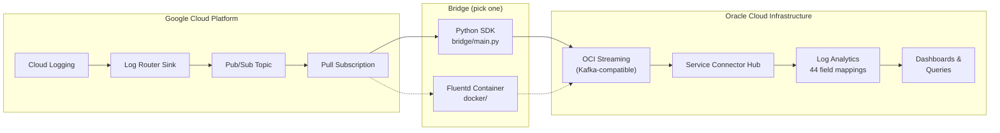
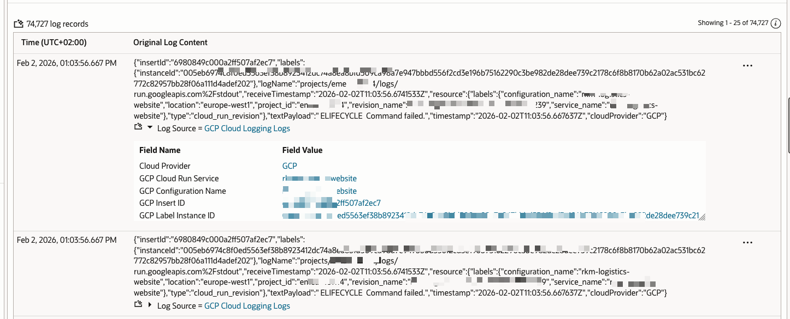
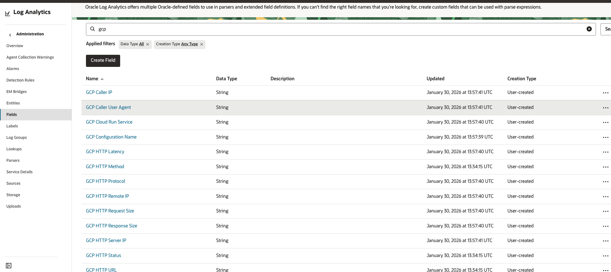
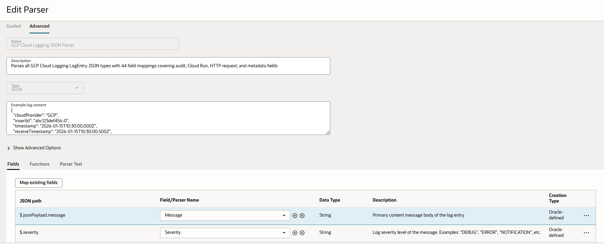

# gcplogs2oci

Stream Google Cloud Platform logs into Oracle Cloud Infrastructure Log Analytics — without VMs.

[](https://cloud.oracle.com/resourcemanager/stacks/create?zipUrl=https://github.com/adibirzu/gcplogs2oci/archive/refs/heads/main.zip)

## Overview

This project implements a serverless log-shipping pipeline that extracts telemetry from **GCP Cloud Logging** via **Pub/Sub** and ingests it into **OCI Log Analytics** through **OCI Streaming**, with a custom parser that maps all GCP Cloud Logging structured fields.

### Architecture



### Provisioned Resources

The setup scripts create the following resources across both cloud providers:

```mermaid
flowchart TB
    subgraph GCP ["GCP Resources (setup_gcp.sh)"]
        direction TB
        G1["Pub/Sub Topic<br/><i>oci-log-export-topic</i>"]
        G2["Pull Subscription<br/><i>fluentd-oci-bridge-sub</i>"]
        G3["Log Router Sink<br/><i>gcp-to-oci-sink</i>"]
        G4["Service Account<br/><i>oci-log-shipper-sa</i>"]
        G5["IAM Bindings<br/><i>Pub/Sub Subscriber + Viewer</i>"]
    end

    subgraph OCI ["OCI Resources (setup_oci.sh)"]
        direction TB
        O1["Stream Pool<br/><i>MultiCloud_Log_Pool</i>"]
        O2["Stream<br/><i>gcp-inbound-stream</i>"]
        O3["Log Analytics Log Group<br/><i>GCPLogs</i>"]
        O4["40 Custom Fields + JSON Parser<br/><i>44 field mappings</i>"]
        O5["Log Analytics Source<br/><i>GCP Cloud Logging Logs</i>"]
        O6["Service Connector Hub<br/><i>GCP-Stream-to-LogAnalytics</i>"]
        O7["IAM Policies<br/><i>SCH stream-pull + log-analytics</i>"]
    end
```



Two bridge implementations are provided:

| Path | Best For | Technology |
|------|----------|------------|
| **Python SDK** (`bridge/`) | Development, testing, local runs | `google-cloud-pubsub` + `oci` SDK |
| **Fluentd Container** (`docker/`) | Production on OCI Container Instances | Fluentd + Kafka plugin |

## Repository Layout

```
├── bridge/                  # Python SDK bridge (GCP Pub/Sub → OCI Streaming)
│   ├── config.py            # Environment-based configuration
│   ├── gcp_subscriber.py    # GCP Pub/Sub streaming-pull consumer
│   ├── oci_stream_sender.py # OCI Streaming PutMessages sender + batching
│   └── main.py              # CLI entry point (--drain / continuous)
├── scripts/
│   ├── setup_gcp.sh         # Provision GCP resources (topic, sub, sink, SA)
│   ├── setup_oci.sh         # Provision OCI resources (stream, log group, parser, source, SCH)
│   ├── destroy_gcp.sh       # Tear down all GCP resources (reverse of setup)
│   ├── destroy_oci.sh       # Tear down all OCI resources (reverse of setup)
│   ├── status.sh            # Audit all resources and configuration
│   ├── test_gcp_credentials.py  # Validate GCP auth
│   ├── test_oci_credentials.py  # Validate OCI auth
│   ├── publish_test_message.py  # Publish sample logs to Pub/Sub
│   └── drain_pubsub_to_oci.sh   # One-shot drain run
├── docker/
│   ├── Dockerfile           # Fluentd image with GCP + Kafka plugins
│   └── fluent.conf          # Fluentd pipeline configuration
├── stack/                   # OCI Resource Manager Stack (Terraform)
│   ├── main.tf              # Provider, data sources, resource blocks
│   ├── variables.tf         # Input variables
│   ├── outputs.tf           # Output values (OCIDs, endpoints)
│   ├── iam.tf               # IAM policies for Service Connector Hub
│   ├── schema.yaml          # OCI Console UI form definition
│   └── scripts/
│       └── setup_log_analytics.py  # Custom fields, parser, source
├── docs/
│   ├── ARCHITECTURE.md      # Data flow, components, failure modes, field mapping
│   └── QUICKSTART.md        # Step-by-step deployment guide
├── .env.example             # Configuration template (copy to .env.local)
├── requirements.txt         # Python dependencies
└── LICENSE.txt              # UPL v1.0
```

## Prerequisites

| Tool | Version | Purpose |
|------|---------|---------|
| Python | 3.11+ | Bridge runtime, credential tests, OCI field/parser creation |
| `gcloud` CLI | Latest | GCP resource provisioning, Application Default Credentials |
| `oci` CLI | Latest | OCI resource provisioning |
| OCI Python SDK | >= 2.124.0 | Bridge OCI sender + setup_oci.sh parser/field creation |
| Docker | Optional | Fluentd production bridge |
| Terraform | >= 1.5.0 (Optional) | OCI Resource Manager Stack deployment |

**GCP requirements:**
- Project with Cloud Logging API and Pub/Sub API enabled
- Authenticated via `gcloud auth application-default login` (recommended) or service account key

**OCI requirements:**
- Tenancy with Streaming and Log Analytics services enabled
- **Log Analytics onboarded** (OCI Console > Observability & Management > Log Analytics > "Start Using Log Analytics")
- API signing key configured (`oci setup config`) and **public key uploaded** to OCI Console (Identity > Users > API Keys)
- IAM policies: user must manage streams, log-analytics, and service-connectors in the target compartment (see [QUICKSTART.md](docs/QUICKSTART.md#required-iam-policies-oci))

## Quick Start

```bash
# 1. Configure
cp .env.example .env.local   # fill in GCP + OCI values

# 2. Install
python3 -m venv .venv && source .venv/bin/activate
pip install -r requirements.txt

# 3. Authenticate GCP (Application Default Credentials)
gcloud auth application-default login

# 4. Provision GCP (topic, subscription, Log Router sink)
./scripts/setup_gcp.sh

# 5. Provision OCI (stream, log group, parser, source, Service Connector Hub)
./scripts/setup_oci.sh

# 6. Validate credentials
python scripts/test_gcp_credentials.py
python scripts/test_oci_credentials.py

# 7. Check infrastructure status
./scripts/status.sh

# 8. Test end-to-end
python scripts/publish_test_message.py --count 5
python -m bridge.main --drain

# 9. Run continuously
python -m bridge.main
```

See [docs/QUICKSTART.md](docs/QUICKSTART.md) for the full walkthrough.

## Managing Infrastructure

### Status audit

Check the state of all provisioned resources, credentials, and configuration:

```bash
./scripts/status.sh
```

Reports `[OK]`, `[WARN]`, or `[FAIL]` for each resource across GCP, OCI, and bridge config. Exit code is the number of failures (0 = all healthy).

### Tear down

Remove all resources created by the setup scripts:

```bash
# Interactive (asks for confirmation)
./scripts/destroy_gcp.sh
./scripts/destroy_oci.sh

# Non-interactive (CI / scripted teardown)
./scripts/destroy_gcp.sh --force
./scripts/destroy_oci.sh --force
```

Deletion order respects resource dependencies (e.g., Service Connector Hub is deleted before Stream). Both scripts handle already-deleted resources gracefully.

### Full reset cycle

```bash
./scripts/destroy_oci.sh --force && ./scripts/destroy_gcp.sh --force
./scripts/setup_gcp.sh && ./scripts/setup_oci.sh
./scripts/status.sh
```

## OCI Resource Manager (Terraform) Deployment

### One-click deploy

[](https://cloud.oracle.com/resourcemanager/stacks/create?zipUrl=https://github.com/adibirzu/gcplogs2oci/archive/refs/heads/main.zip)

1. Click the button above, sign in to your OCI tenancy
2. Select **`stack/`** as the working directory when prompted
3. Fill in the form (compartment, region, stream names, etc.)
4. Click **Plan** then **Apply**

### Manual upload

Alternatively, package and upload the stack yourself:

```bash
cd stack && zip -r ../gcplogs2oci-stack.zip . && cd ..
```

Then navigate to **OCI Console > Developer Services > Resource Manager > Stacks > Create Stack** and upload the `.zip` file.

### Create Log Analytics custom content

After the stack is applied, create the parser, fields, and source (not supported by the Terraform provider):

```bash
pip install oci    # if not already installed
export LA_NAMESPACE="<your-namespace>"
export OCI_COMPARTMENT_ID="<your-compartment-ocid>"
python3 stack/scripts/setup_log_analytics.py
```

### Local Terraform apply

```bash
cd stack
terraform init
terraform plan -var="compartment_ocid=ocid1.compartment..." \
               -var="region=eu-frankfurt-1" \
               -var="tenancy_ocid=ocid1.tenancy..."
terraform apply
```

The stack creates the same OCI resources as `setup_oci.sh` (Stream Pool, Stream, Log Group, SCH, IAM policies). The Python helper script handles Log Analytics custom content (40 fields, 44-mapping JSON parser, source) which has no Terraform provider support.

## Configuration

All settings are read from environment variables. Copy `.env.example` to `.env.local` and fill in your values. The file is listed in `.gitignore` and never committed.

### Required Variables

| Variable | Description |
|----------|-------------|
| `GCP_PROJECT_ID` | GCP project ID |
| `GCP_PUBSUB_SUBSCRIPTION` | Pull subscription name |
| `OCI_MESSAGE_ENDPOINT` | OCI Streaming message endpoint URL |
| `OCI_STREAM_OCID` | OCI Stream OCID (not Stream Pool) |
| `OCI_USER_OCID` | OCI user OCID |
| `OCI_KEY_FILE` or `OCI_KEY_CONTENT` | Path to PEM key file (local dev) or inline PEM string (CI/containers) |
| `OCI_FINGERPRINT` | API key fingerprint |
| `OCI_TENANCY_OCID` | Tenancy OCID |
| `OCI_REGION` | OCI region (e.g., `eu-frankfurt-1`) |
| `OCI_COMPARTMENT_OCID` | Compartment OCID (used by `setup_oci.sh`) |

### GCP Authentication

The bridge uses **Application Default Credentials (ADC)**. For local development:

```bash
gcloud auth application-default login
```

For CI/production, set `GOOGLE_APPLICATION_CREDENTIALS` to a service account key file. The service account needs roles: `Pub/Sub Subscriber`, `Pub/Sub Viewer`.

### Optional Variables

| Variable | Default | Description |
|----------|---------|-------------|
| `GCP_PUBSUB_TOPIC` | `oci-log-export-topic` | Pub/Sub topic name |
| `GCP_LOG_FILTER` | `severity >= DEFAULT` | Log Router sink filter |
| `OCI_LOG_ANALYTICS_NAMESPACE` | Auto-detected | Log Analytics namespace |
| `OCI_LOG_GROUP_NAME` | `GCPLogs` | Log Analytics log group name |
| `OCI_SCH_NAME` | `GCP-Stream-to-LogAnalytics` | Service Connector Hub name |
| `MAX_BATCH_SIZE` | `100` | Max messages per OCI batch |
| `MAX_BATCH_BYTES` | `1048576` | Max batch size in bytes |
| `INACTIVITY_TIMEOUT` | `30` | Seconds before drain mode exits |

See `.env.example` for the full list.

## GCP Cloud Logging Parser

The `setup_oci.sh` script creates a custom **GCP Cloud Logging JSON Parser** in OCI Log Analytics with **44 field mappings** covering all GCP Cloud Logging [LogEntry](https://cloud.google.com/logging/docs/reference/v2/rest/v2/LogEntry) resource types.

The bridge injects `cloudProvider: "GCP"` into every log entry for multicloud dashboard filtering.

### OCI Log Analytics Screenshots

**Log Explorer** — GCP Cloud Logging logs with extracted fields:



**Custom Fields** — 40 GCP-specific fields created by the setup script:



**JSON Parser** — 44 field mappings from GCP LogEntry JSON paths:



### Supported Resource Types

| Resource Type | Log Types | Key Fields Extracted |
|---------------|-----------|---------------------|
| `gce_instance` | Audit (cloudaudit) | Zone, Instance ID, Method, Principal |
| `cloud_run_revision` | HTTP requests, stdout | Service, Revision, Location, HTTP details |
| `pubsub_topic` | Audit | Topic ID, Resource Name |
| `pubsub_subscription` | Audit | Subscription ID, Resource Name |
| `logging_sink` | Audit | Sink Name, Destination |
| `project` | Audit (IAM) | Resource Name, Caller IP |

### Field Categories (44 total)

**Built-in** (4): Message, Severity, Time, Method

**Multicloud** (1): Cloud Provider (`$.cloudProvider`)

**Core LogEntry** (13): Insert ID, Log Name, Resource Type, Project ID, Service Name, Method Name, Principal Email, Zone, Instance ID, Trace ID, Span ID, Text Payload, Receive Timestamp

**HTTP Request** (10): Method, URL, Status, Latency, Protocol, Remote IP, Request Size, Response Size, Server IP, User Agent

**Cloud Run** (5): Configuration Name, Location, Cloud Run Service, Revision Name, Label Instance ID

**Audit Extended** (3): Resource Name, Caller IP, Caller User Agent

**Resource Labels** (4): Subscription ID, Topic ID, Sink Name, Sink Destination

**Operation & Source Location** (4): Operation ID, Source File, Source Line, Source Function

See [docs/ARCHITECTURE.md](docs/ARCHITECTURE.md) for the full JSON path mapping tables.

## Expanding Log Collection

The default `setup_gcp.sh` creates a Log Router sink with the filter `severity >= ERROR`. You can expand this to capture logs from any of the [150+ GCP services that emit audit logs](https://cloud.google.com/logging/docs/audit/services).

### GCP Audit Log Types

GCP Cloud Logging produces four audit log types, each with a different log name suffix:

| Type | Log Name Suffix | Enabled By Default | Description |
|------|----------------|--------------------|-------------|
| **Admin Activity** | `activity` | Yes (always on) | Resource config/metadata changes |
| **Data Access** | `data_access` | No (except BigQuery) | Data reads/writes, config reads |
| **System Event** | `system_event` | Yes (always on) | Google-driven system actions |
| **Policy Denied** | `policy` | Yes (always on) | Security policy violations |

### Customizing the Log Router Filter

Edit `GCP_LOG_FILTER` in `.env.local` before running `setup_gcp.sh`, or update an existing sink:

```bash
# Capture all audit logs (Admin Activity + Data Access + System Event + Policy Denied)
GCP_LOG_FILTER='logName:"cloudaudit.googleapis.com"'

# Capture all logs at INFO and above
GCP_LOG_FILTER='severity >= INFO'

# Capture audit logs from specific services
GCP_LOG_FILTER='logName:"cloudaudit.googleapis.com" AND protoPayload.serviceName=("compute.googleapis.com" OR "storage.googleapis.com" OR "container.googleapis.com")'

# Capture Cloud Run HTTP request logs + audit logs
GCP_LOG_FILTER='resource.type="cloud_run_revision" OR logName:"cloudaudit.googleapis.com"'

# Capture everything (high volume — use with caution)
GCP_LOG_FILTER='severity >= DEFAULT'
```

To update an existing sink filter without re-running setup:

```bash
gcloud logging sinks update gcp-to-oci-sink \
    --log-filter='logName:"cloudaudit.googleapis.com"'
```

### Common GCP Services and Their Logs

The parser's 44 field mappings already cover the [LogEntry](https://cloud.google.com/logging/docs/reference/v2/rest/v2/LogEntry) and [AuditLog](https://cloud.google.com/logging/docs/audit#audit_log_entry_structure) structures used by all GCP services. Key services include:

| Service | `resource.type` | Log Content |
|---------|-----------------|-------------|
| **Compute Engine** | `gce_instance` | Instance lifecycle, SSH access, API calls |
| **Cloud Run** | `cloud_run_revision` | HTTP requests, container stdout/stderr |
| **GKE** | `k8s_cluster`, `k8s_container` | Cluster operations, pod logs |
| **Cloud Storage** | `gcs_bucket` | Bucket access, object operations |
| **BigQuery** | `bigquery_resource` | Query execution, dataset access |
| **Cloud SQL** | `cloudsql_database` | Database operations, connections |
| **Cloud Functions** | `cloud_function` | Function execution, errors |
| **IAM** | `project` | Role grants, policy changes |
| **VPC** | `gce_subnetwork` | Firewall rules, flow logs |
| **Pub/Sub** | `pubsub_topic`, `pubsub_subscription` | Topic/subscription operations |
| **Cloud Load Balancing** | `http_load_balancer` | Request logs with full HTTP details |

### Enabling Data Access Logs

Data Access audit logs are disabled by default for most services. Enable them in the GCP Console or via `gcloud`:

```bash
# Enable Data Access logs for Cloud Storage
gcloud projects get-iam-policy $GCP_PROJECT_ID --format=json > /tmp/policy.json
# Edit the auditConfigs section, then:
gcloud projects set-iam-policy $GCP_PROJECT_ID /tmp/policy.json
```

Or in the GCP Console: **IAM & Admin > Audit Logs** > select service > check **Data Read** / **Data Write**.

### Structured Logging from Applications

Applications running on GCP (Cloud Run, GKE, Compute Engine) can emit [structured logs](https://cloud.google.com/logging/docs/structured-logging) that the parser automatically handles:

```json
{
  "severity": "ERROR",
  "message": "Failed to process request",
  "httpRequest": { "requestMethod": "POST", "requestUrl": "/api/orders", "status": 500 },
  "logging.googleapis.com/trace": "projects/my-project/traces/abc123",
  "logging.googleapis.com/spanId": "000000000000004a"
}
```

All `jsonPayload`, `httpRequest`, `trace`, `spanId`, and `sourceLocation` fields are extracted by the parser into OCI Log Analytics custom fields — no parser changes needed.

### Parser Coverage

The GCP Cloud Logging JSON parser handles **all** GCP log types without modification because:

1. **Core fields** (`insertId`, `severity`, `timestamp`, `resource.type`, `logName`) are present in every LogEntry
2. **Audit fields** (`protoPayload.*`) are extracted when present (audit logs)
3. **HTTP fields** (`httpRequest.*`) are extracted when present (Cloud Run, Load Balancer)
4. **Resource labels** (`resource.labels.*`) are extracted for all resource types
5. **Missing fields** result in null values — no parsing errors

To add support for new resource-specific labels, see the [Architecture doc](docs/ARCHITECTURE.md) field mapping tables.

## Docker / Fluentd Path

For production deployments on OCI Container Instances:

```bash
docker build -t gcp-oci-bridge:latest docker/
docker tag gcp-oci-bridge:latest <region>.ocir.io/<tenancy>/<repo>/bridge:latest
docker push <region>.ocir.io/<tenancy>/<repo>/bridge:latest
```

Secrets are mounted from OCI Vault — see [docs/ARCHITECTURE.md](docs/ARCHITECTURE.md).

## Security

- **No embedded secrets**: All credentials are loaded from `.env.local` (local) or OCI Vault (production)
- **ADC preferred**: GCP authentication uses Application Default Credentials, no key file needed for local dev
- **Least privilege**: GCP service account has only Pub/Sub Subscriber + Viewer roles
- **Private networking**: Container Instance runs in a private subnet with NAT gateway
- **Git safety**: `.gitignore` excludes `.env.local`, `*.pem`, `*.key`, and `gcp-sa-key.json`

## License

Copyright (c) 2025 Oracle and/or its affiliates. Released under the [Universal Permissive License v1.0](LICENSE.txt).
